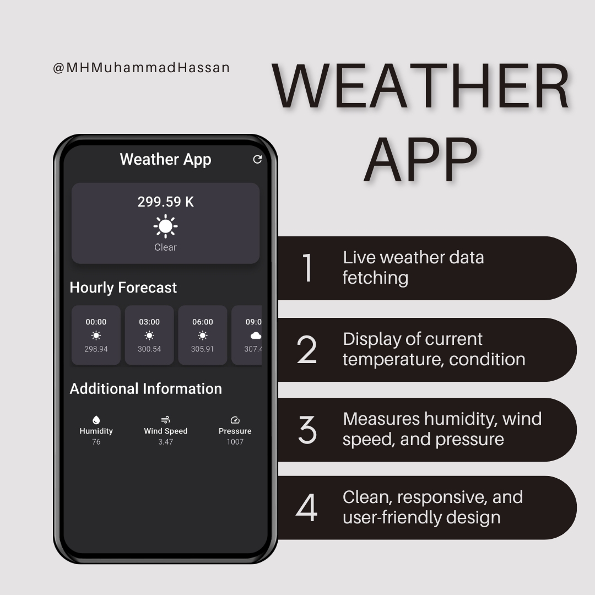

# 🌦️ Weather App - Flutter



A beautifully crafted Weather App built with **Flutter**, delivering real-time weather updates using the [OpenWeatherMap API](https://openweathermap.org/). The app demonstrates responsive UI design, external API integration, and custom widget architecture for seamless user experience.

---

## 🚀 Features

- 🔁 Real-time weather data fetching using `http`
- 🌡️ Current weather display:
  - Temperature
  - Weather condition
  - Humidity
  - Wind speed
  - Atmospheric pressure
- 🕐 Hourly weather forecast
- 🎨 Sleek, clean, and fully responsive user interface
- 🧱 Modular architecture with custom reusable widgets
- 🌍 Multi-location support ready
- 🕓 Time formatting using `intl`
- 🧮 Lightweight calculations using `math_expressions`
- 💾 State persistence using **Shared Preferences**

---

## 🧰 Tech Stack

- **Framework:** Flutter
- **Language:** Dart
- **API:** OpenWeatherMap
- **Packages:**
  - [`http`](https://pub.dev/packages/http)
  - [`intl`](https://pub.dev/packages/intl)
  - [`math_expressions`](https://pub.dev/packages/math_expressions)
  - [`shared_preferences`](https://pub.dev/packages/shared_preferences)

---

## 👨‍💻 Author

**Muhammad Hassan**  
[LinkedIn](https://www.linkedin.com/in/mh-muhammadhassan/)

---

## 🤝 Contributions

Contributions are welcome!  
Feel free to open issues or submit pull requests to enhance the project.

---


## 🧑‍💻 Getting Started

To set up and run the project locally:

```bash
git clone https://github.com/MH-MuhammadHassan/weather-app
cd weather-app
flutter pub get
flutter run
